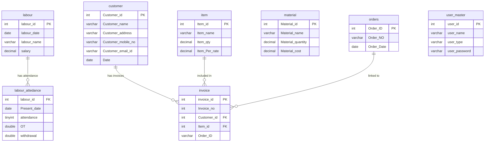

# 🏗️ LabourMgmt

### Construction Workforce & Project Management Suite

[](https://php.net)
[](https://mariadb.org)
[](https://tailwindcss.com)
[](https://jquery.com)
[](LICENSE)

A full-stack web application for managing construction labour attendance, payroll, materials inventory, and invoice generation — built with PHP, MySQL, and a modern Material Design-inspired UI.

[Features](#-features) · [Screenshots](#-screenshots) · [Installation](#-installation) · [Tech Stack](#-tech-stack) · [Project Structure](#-project-structure) · [API Reference](#-api-reference) · [Contributing](#-contributing)

</div>

---

## ✨ Features

<table>
<tr>
<td width="50%">

### 👷 Labour Management
- Add, edit, and delete labour records
- Store worker details with joining date and salary
- Dynamic data table with avatar initials
- Real-time AJAX-powered CRUD operations

</td>
<td width="50%">

### 📋 Attendance Tracking
- Daily attendance registry (Present/Absent)
- Bulk attendance submission via AJAX
- Filter by labourer and month
- Comprehensive attendance log with pagination

</td>
</tr>
<tr>
<td width="50%">

### 💰 Payroll & Salary
- Automatic salary calculation based on attendance
- Overtime (OT) tracking and management
- Withdrawal/advance recording
- Net pay computation (Base + OT − Withdrawals)
- Detailed salary status panel per worker

</td>
<td width="50%">

### 🧾 Invoice Management
- Create and manage project invoices
- Link invoices to customers, items, and orders
- Revenue tracking dashboard
- Search and filter invoices
- View detailed invoice breakdowns

</td>
</tr>
<tr>
<td width="50%">

### 📦 Materials Inventory
- Track construction materials and quantities
- Unit pricing and inventory valuation
- Category-based organization
- Low stock indicators
- Add/Edit/Delete material records

</td>
<td width="50%">

### 🎨 Modern UI/UX
- Material Design 3 inspired color system
- Responsive sidebar + top navigation
- Toast notification system
- Modal dialogs with backdrop blur
- Skeleton loading animations
- Mobile-first responsive design

</td>
</tr>
</table>

---

## 🛠️ Tech Stack

| Layer | Technology |
|---|---|
| **Frontend** | HTML5, TailwindCSS (CDN), jQuery 3.6 |
| **Backend** | PHP 8.2 |
| **Database** | MariaDB 10.4 (MySQL) |
| **Server** | Apache (XAMPP) |
| **Fonts** | Google Fonts — Manrope, Inter |
| **Icons** | Material Symbols Outlined |
| **URL Routing** | Apache `.htaccess` mod_rewrite |

---

## 📸 Screenshots

> _Add your screenshots here_
>
> **Suggested screenshots:**
> - Dashboard (Attendance & Labour Records)
> - 
> - Labour Attendance & Payroll Page
> - 
> - Invoice Management
> - 
> - Materials Inventory
> - 


---

## 🚀 Installation

### Prerequisites

- [XAMPP](https://www.apachefriends.org/) (or any Apache + PHP + MySQL stack)
- PHP ≥ 8.0
- MariaDB / MySQL
- `mod_rewrite` enabled in Apache

### Steps

```bash
# 1. Clone the repository
git clone https://github.com/arpitbariya-blip/LabourMgmt.git

# 2. Move to your web server directory
# For XAMPP on Windows:
mv labourmgmt C:/xampp/htdocs/

# For XAMPP on macOS/Linux:
mv labourmgmt /opt/lampp/htdocs/
```

```bash
# 3. Start Apache and MySQL via XAMPP Control Panel
```

```sql
-- 4. Create the database
--    Open phpMyAdmin (http://localhost/phpmyadmin)
--    Create a new database named: labourmgmt
--    Import the SQL file:

SOURCE /path/to/labourmgmt/DB File/labourmgmt.sql;
```

> **Alternative:** In phpMyAdmin, go to **Import** → select `DB File/labourmgmt.sql` → click **Go**

```bash
# 5. Configure database connection (if needed)
# Edit: api/connect.php
# Default config:
#   Host: localhost
#   User: root
#   Password: (empty)
#   Database: labourmgmt
```

```
# 6. Open in browser
http://localhost/labourmgmt
```

---

## 📁 Project Structure

```
labourmgmt/
├── 📄 .htaccess                 # URL rewriting & security headers
├── 📄 index.php                 # Session availability / response form
├── 📄 login.php                 # Authentication page (MHT ID login)
├── 📄 logout.php                # Session destroy & redirect
├── 📄 dashboard.php             # Attendance registry + labour records
├── 📄 labour_atds.php           # Labour attendance & payroll management
├── 📄 invoice.php               # Invoice listing & management
├── 📄 invoice_main.php          # Detailed invoice view
├── 📄 material.php              # Materials inventory management
├── 📄 submit_selected.php       # Bulk attendance submission handler
│
├── 📂 api/                      # Backend API endpoints
│   ├── connect.php              # Database connection
│   ├── auth.php                 # Login authentication
│   ├── create.php               # Create labour record
│   ├── create_invoice.php       # Create new invoice
│   ├── fetch_labour.php         # Fetch all labourers (JSON)
│   ├── fetch_salary_status.php  # Salary calculation endpoint
│   ├── save_ot_withdrawal.php   # Save OT/withdrawal transactions
│   ├── delete_attendance.php    # Delete attendance record
│   ├── Loadtable.php            # Load attendance table data
│   └── 📂 ajax/                 # Additional AJAX handlers
│
├── 📂 includes/                 # Shared components
│   ├── header.php               # HTML head section
│   └── navbar.php               # Sidebar + top navigation bar
│
├── 📂 css/
│   └── style.css                # Custom styles
│
├── 📂 DB File/
│   └── labourmgmt.sql           # Database schema & seed data
│
└── 📂 other_pending/            # Work-in-progress files
    ├── login.html               # Login page prototype
    ├── invoice.html             # Invoice page prototype
    └── curlexamp.php            # cURL example
```

---

## 🗄️ Database Schema

The application uses **7 tables** in the `labourmgmt` database:



---

## 📡 API Reference

All API endpoints are located in the `api/` directory. Clean URLs are supported via `.htaccess` rewriting (e.g., `api/fetch_labour` instead of `api/fetch_labour.php`).

| Method | Endpoint | Description |
|--------|----------|-------------|
| `GET` | `/api/fetch_labour` | Fetch all labour records (JSON) |
| `POST` | `/api/create` | Add a new labour record |
| `POST` | `/api/Loadtable` | Load attendance table by labourer & month |
| `POST` | `/api/fetch_salary_status` | Get salary breakdown for a labourer |
| `POST` | `/api/save_ot_withdrawal` | Record OT or withdrawal transaction |
| `POST` | `/api/delete_attendance` | Delete an attendance record |
| `POST` | `/api/create_invoice` | Create a new invoice |

### Example Request

```javascript
// Fetch all labourers
$.ajax({
  url: 'api/fetch_labour',
  method: 'GET',
  success: function(response) {
    let data = JSON.parse(response);
    console.log(data);
  }
});
```

### Example Response

```json
[
  {
    "labour_id": "26",
    "labour_name": "suresh mohaniya",
    "labour_date": "2024-06-07",
    "salary": "650.00"
  }
]
```

---

## ⚙️ Configuration

### Database Connection

Edit `api/connect.php` to update your database credentials:

```php
<?php
$conn = mysqli_connect("localhost", "root", "", "labourmgmt");

if (!$conn) {
    die("Connection Failed");
}
```

### URL Rewriting

The `.htaccess` file handles:
- ✅ Removal of `.php` extensions from URLs
- ✅ Clean API routing (`api/create_invoice` → `api/create_invoice.php`)
- ✅ Security headers (X-Content-Type-Options, XSS Protection, X-Frame-Options)
- ✅ Directory listing prevention
- ✅ UTF-8 default charset

---

## 🤝 Contributing

Contributions are welcome! Here's how to get started:

1. **Fork** the repository
2. **Create** a feature branch (`git checkout -b feature/amazing-feature`)
3. **Commit** your changes (`git commit -m 'Add amazing feature'`)
4. **Push** to the branch (`git push origin feature/amazing-feature`)
5. **Open** a Pull Request

### Development Guidelines

- Follow the existing code style and naming conventions
- Use the Material Design 3 color tokens defined in `navbar.php`
- Keep API responses in JSON format
- Test with both desktop and mobile viewports

---

## 📝 Roadmap

- [ ] Export attendance & payroll reports to PDF/Excel
- [ ] Dashboard analytics with charts
- [ ] Email notifications for salary disbursements
- [ ] Multi-project support
- [ ] REST API with token-based authentication
- [ ] Dark mode toggle
- [ ] PWA support for mobile usage

---

## 📄 License

This project is licensed under the **MIT License** — see the [LICENSE](LICENSE) file for details.

---

<div align="center">

**Built with ❤️ for the construction industry**

⭐ Star this repo if you found it useful!

</div>
